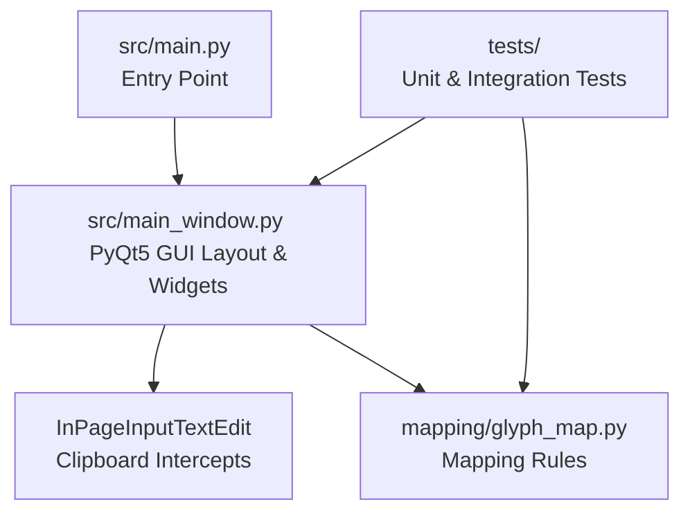
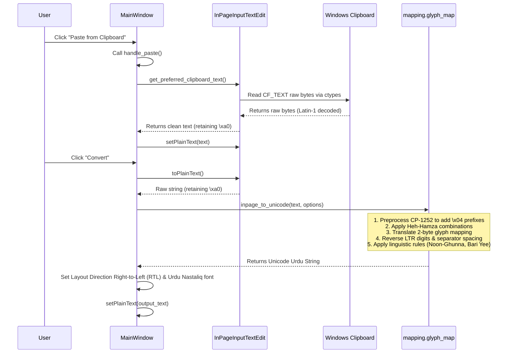

# Code Documentation - InPage ↔ Unicode Urdu Converter

This document provides a detailed overview of the codebase structure, modules, functions, data flow, and runtime dependencies.

---

## 📂 Project Structure

```
InPageToUnicode/
├── assets/
│   ├── fonts/
│   │   └── NotoNastaliqUrdu-Regular.ttf  # Bundled Nastaliq Urdu font file
│   └── icon.ico                         # Windows application icon
├── mapping/
│   ├── __init__.py
│   └── glyph_map.py                     # Bidirectional glyph mapping tables and functions
├── src/
│   ├── main.py                          # Application entry point
│   └── main_window.py                   # PyQt5 main GUI window layout & behavior
├── tests/
│   ├── test_gui.py                      # GUI integration tests
│   └── test_pairs.py                    # Unit tests for conversion mappings and logic
├── .gitignore                           # Git ignore rules for virtualenvs, caches, etc.
├── InPageConverter.spec                 # PyInstaller packaging configuration
├── inno_setup.iss                       # Inno Setup 6 installer creation script
├── LICENSE                              # GNU GPL v3 license file
├── README.md                            # Main project repository guide
├── CODE_DOCUMENTATION.md                # Codebase engineering architecture documentation
├── DESIGN_PHILOSOPHY.md                 # Design principles and technical trade-offs
└── CONTRIBUTING.md                      # Guide for developers contributing to the project
```

---

## 🏛️ High-Level Architecture

The project is structured under an offline-first MVC-like architecture to decouple core logic from presentation:



1.  **Entry Point (`src/main.py`)**: Boots up the application and runs the PyQt5 UI thread.
2.  **Presentation Layer (`src/main_window.py`)**: Holds all layout styles, GUI elements, user interactions, error dialogs, and raw Windows clipboard ctypes logic.
3.  **Domain Logic Layer (`mapping/glyph_map.py`)**: Self-contained module mapping legacy glyph encodings to standard Unicode characters. Holds zero references to PyQt5 and can be tested fully via command line or automated runners.

---

## ⚙️ Core Modules & Functions

| File Path | Function / Class / Component | Description |
| :--- | :--- | :--- |
| `src/main.py` | Entry point | Configures high DPI support, instantiates `QApplication` and `MainWindow`, loads system resources, and starts the PyQt5 event loop. |
| `src/main_window.py` | `MainWindow` (Class) | Subclass of `QMainWindow` defining layout, styling sheets (QSS), events, validation, and file exporting. |
| `src/main_window.py` | `InPageInputTextEdit` (Class) | Custom `QTextEdit` widget overriding paste, copy, and plaintext accessors. Bypasses standard copy/paste normalizations to keep non-breaking spaces (`\xa0`). |
| `src/main_window.py` | `get_raw_clipboard_bytes` | Bypasses standard clipboard calls via Windows `ctypes` API. Directly grabs CP-1252 bytes from Windows `CF_TEXT` format. |
| `src/main_window.py` | `get_preferred_clipboard_text` | Decides between PyQt standard clipboard text and raw `ctypes` bytes, checking for lossy conversion. |
| `mapping/glyph_map.py`| `inpage_to_unicode(text, options)` | Converts legacy InPage string to standard Unicode Urdu text. Takes config options (digits reversal, Heh-Hamza combination, Kashida removal, etc.). |
| `mapping/glyph_map.py`| `unicode_to_inpage(text)` | Reverses Unicode Urdu text back to legacy InPage encoding using a separate contextual map. |

---

## 🔄 Data Flow (InPage → Unicode Conversion)

Below is the execution flow when a user pastes text and converts InPage legacy text to Unicode:



---

## 📦 Dependencies

*   **Runtime Dependencies**:
    *   `PyQt5>=5.15`: Provides the GUI widgets, application loop, clipboard structures, and layout styling engine.
*   **Build/Development Dependencies**:
    *   `pyinstaller>=6.0`: Compiles the Python scripts and assets (icon and font) into a standalone `.exe`.
    *   `Inno Setup 6 (External)`: Standard installer compiler for Windows platforms.
