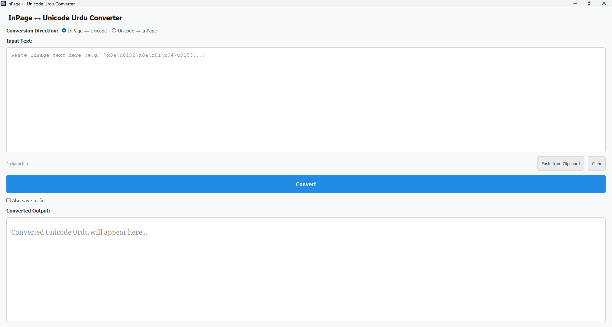

# InPage ↔ Unicode Urdu Converter

[](https://www.gnu.org/licenses/gpl-3.0)

A lightweight, offline-first Windows desktop application built in Python and PyQt5 to convert Urdu text bidirectionally between InPage's legacy glyph encoding (CP-1252/custom) and standard Unicode.
This is a paste-based text converter that bypasses the need to parse binary `.inp` files, designed to easily migrate text databases between legacy print layouts and modern web formats.



---
## 🚀 Key Features
*   **Bidirectional Conversion**: Select between `InPage → Unicode` and `Unicode → InPage` modes.
*   **Offline-First**: Runs entirely on the local machine with no external network calls, telemetry, or API requirements.
*   **Nastaliq Rendering**: Bundles Google's **Noto Nastaliq Urdu** font and automatically configures Right-to-Left (RTL) reading layout for Unicode text, ensuring consistent rendering on any Windows machine.
*   **Raw Clipboard Bypass**: Uses a Windows `ctypes` clipboard integration to access raw clipboard bytes directly, bypassing lossy Windows ANSI/Unicode translations that strip character markers (like non-breaking spaces `\xa0` representing *Noon*).
*   **Optional File Output**: Direct toggle to export converted outputs into a clean, UTF-8 encoded `.txt` file via native Windows file dialogs.
*   **Character Statistics & Validation**: Live input character count, warning dialogs for empty entries, and basic heuristic checking to prevent incorrect conversion directions.
---
## 🛠️ Developer Setup & Installation
### Prerequisites
*   **Python 3.8+**
*   Windows OS (for ctypes raw clipboard operations and packaging)
### Installation
1.  **Clone the repository**:
    ```bash
    git clone https://github.com/salmanasmat/InPageToUnicode.git
    cd InPageToUnicode
    ```
2.  **Create and activate a virtual environment**:
    ```powershell
    python -m venv .venv
    .\.venv\Scripts\Activate.ps1
    ```
3.  **Install dependencies**:
    ```bash
    pip install -r requirements.txt
    ```
4.  **Run the application**:
    ```bash
    python src/main.py
    ```
---
## 🧪 Running Unit Tests
The codebase includes comprehensive unit tests verifying mapping coverage, digits reversal, Hamza correction, quotation rules, and clipboard handling.
To execute the test suite:
```bash
python -m unittest discover -s tests
```
---
## 📦 Build & Packaging Instructions
### Standalone Executable (.exe)
The application can be compiled into a single executable using PyInstaller. A spec file is already provided:
```bash
pyinstaller InPageConverter.spec
```
The packaged executable will be generated inside the `dist/` directory with all assets (icon, Nastaliq font, mapping module) bundled natively.
### Windows Installer
An Inno Setup compiler script (`inno_setup.iss`) is included to package the executable into a setup installer:
1.  Ensure you have **Inno Setup 6** installed.
2.  Compile the installer:
    ```powershell
    ISCC.exe inno_setup.iss
    ```
The output installer will be saved to the `installer-output/` directory.
---
## ⚠️ Known Limitations
*   **Text-only Conversion**: This application processes plain text only. InPage text styling (e.g. bold, italics, custom font sizes, text boxes, tables, pages, and images) is **not** preserved.
*   **Encoding Dependability**: Accuracy depends on standard InPage glyph mapping conventions. Highly corrupted or non-standard font maps in legacy files may require manual correction.
---
## 📄 License
This project is licensed under the **GNU General Public License v3 (GPL v3)**. See the [LICENSE](LICENSE) file for the full text.
Copyright (C) 2026 [Salman Asmat](https://github.com/salmanasmat)
