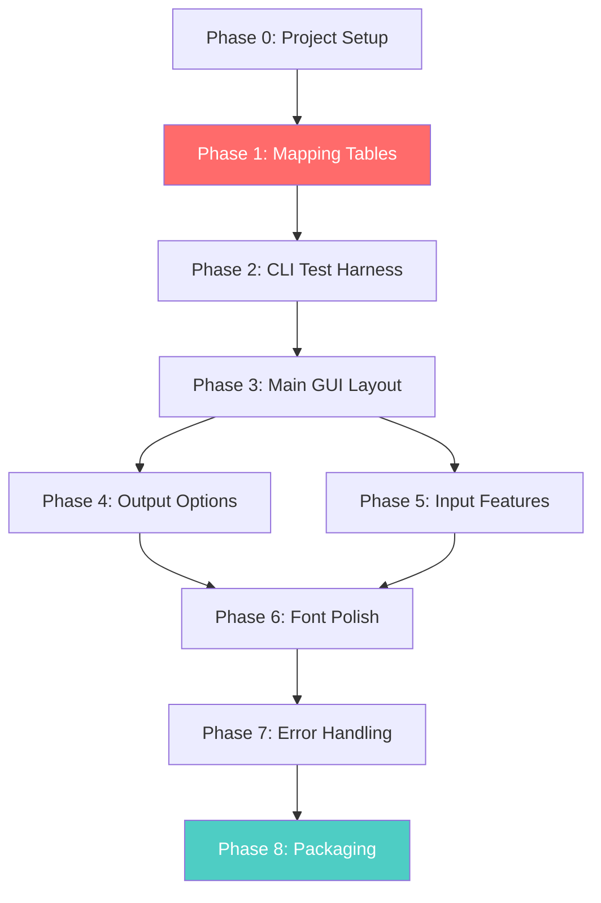

# InPage ↔ Unicode Urdu Converter — Implementation Plan

## Background

A Windows desktop application (Python + PyQt5) that converts Urdu text between InPage's legacy glyph encoding and standard Unicode. Paste-based only (no `.inp` binary file parsing). Bidirectional conversion. Packaged as a standalone `.exe` via PyInstaller.

> [!IMPORTANT]
> InPage uses a **proprietary glyph-based encoding** where characters are stored as **two-byte wide-char sequences** (prefix `0x0004` + glyph byte). The same Urdu letter maps to different byte codes depending on its positional form (isolated/initial/medial/final) and ligature context. The mapping is **many-to-one** in the forward direction, meaning the reverse (Unicode→InPage) requires contextual analysis — it cannot be auto-derived by reversing the forward dictionary.

---

## Open Questions

> [!IMPORTANT]
> **Font bundling**: Which Nastaliq Urdu font do you prefer to bundle?
> - **Noto Nastaliq Urdu** (Google, open-source OFL license, ~1.3MB) — more broadly compatible
> - **Jameel Noori Nastaleeq** (widely used in Pakistan, but licensing may be restrictive)
> - Or both, with Noto as primary and Jameel as a user option?

> [!NOTE]
> **Test data**: The reference repos' test files (`story.inp` / `story.txt`) are for binary `.inp` parsing, not paste-based text. We will need to create paste-based test pairs manually by:
> 1. Pasting InPage text from actual InPage documents
> 2. Using known short Urdu phrases and their InPage encodings from the C++ repo's mapping tables
> 3. Verifying round-trip accuracy

---

## Proposed Changes

### Project Structure (Final)

```
InPageToUnicode/
├── src/
│   ├── main.py                  # Entry point
│   ├── main_window.py           # PyQt5 GUI window/layout
│   └── test_conversion.py       # Temporary CLI test harness (Phase 2)
├── mapping/
│   ├── __init__.py
│   └── glyph_map.py             # InPage↔Unicode mapping tables + conversion functions
├── assets/
│   ├── fonts/                   # Bundled Nastaliq Urdu font file(s)
│   └── icon.ico                 # App icon
├── tests/
│   └── test_pairs.py            # Known InPage/Unicode test pairs
├── requirements.txt
├── README.md
├── PROJECT_SPEC.md              # (existing)
├── MAPPING_REQUIREMENTS.md      # (existing)
└── PHASED_BUILD_PROMPTS.md      # (existing)
```

---

## Phase 0 — Project Setup

### What we do
Set up the skeleton project structure, virtual environment, and a minimal PyQt5 window.

#### [NEW] [requirements.txt](file:///d:/Reports/Scripting/Antigravity/InPageToUnicode/requirements.txt)
- `PyQt5>=5.15`
- `pyinstaller>=6.0` (for Phase 8)

#### [NEW] [src/main.py](file:///d:/Reports/Scripting/Antigravity/InPageToUnicode/src/main.py)
- Entry point: creates `QApplication`, instantiates the main window, runs the event loop
- Window title: `"InPage ↔ Unicode Urdu Converter"`, size 900×600

#### [NEW] [mapping/__init__.py](file:///d:/Reports/Scripting/Antigravity/InPageToUnicode/mapping/__init__.py)
- Empty init to make `mapping` a Python package

### Verification
- Run `python src/main.py` — a blank PyQt5 window should open with the correct title and size

---

## Phase 1 — Mapping Table Module (THE HARD PART)

> [!CAUTION]
> This is the most critical and complex phase. The mapping tables and conversion logic must be ported faithfully from the reference repositories. Getting this wrong means all subsequent phases produce incorrect output.

### What we do
Create `mapping/glyph_map.py` with complete bidirectional mapping.

#### [NEW] [mapping/glyph_map.py](file:///d:/Reports/Scripting/Antigravity/InPageToUnicode/mapping/glyph_map.py)

**Source Material & Porting Strategy:**

| Direction | Primary Source | Language | Key File |
|-----------|---------------|----------|----------|
| InPage → Unicode | [ltrc/inPageToUnicode](https://github.com/ltrc/inPageToUnicode) | JavaScript | `inPage2Unicode.js` |
| Unicode → InPage | [UmerCodez/unicode-inpage-converter](https://github.com/UmerCodez/unicode-inpage-converter) | C++ | `Converter.cpp` |
| Cross-check | [HassamChundrigar/InpageToUnicode](https://github.com/HassamChundrigar/InpageToUnicode) | Python | Python port of ltrc |
| Both (PHP) | [zanysoft/unicode-inpage-converter](https://github.com/zanysoft/unicode-inpage-converter) | PHP | `src/Inpage.php` |

**Implementation approach:**

1. **Clone all 4 reference repos locally** using `git clone` to get complete, untruncated source files
2. **Port the InPage→Unicode mapping** from the C++ repo's `buildITUmapping()` function:
   - The mapping uses `std::map<std::wstring, std::wstring>` with two-byte InPage sequences as keys (e.g., `L"\u0004\u00A1"` → `L"\u06BA"`)
   - Multi-character sequences (ligatures like Yaa+Hamza) must be processed **before** single-character mappings
   - Port to Python dict: `ITU_MAP = {'\u0004\u00A1': '\u06BA', ...}`
3. **Port the Unicode→InPage mapping** from the C++ repo's `buildUTImapping()` function:
   - This is the reverse mapping, separately hand-coded (NOT auto-reversed)
   - Port to Python dict: `UTI_MAP = {'\u06BA': '\u0004\u00A1', ...}`
4. **Port post-processing options** from the JS repo's `processInput()`:
   - Heh+Hamza correction (default: ON)
   - Kashida removal (default: OFF)
   - Quotation marks reversal (default: OFF)
   - Digit reversal (default: ON)
   - Reversed S-sign (default: ON)
   - Thousands separator (default: ON)
   - Bari Yee correction (default: ON)
   - Double space removal (default: ON)
   - Erab/diacritics removal (default: OFF)
   - Year sign correction (default: ON)

**Functions exposed:**

```python
# Configurable options with sensible defaults
DEFAULT_OPTIONS = {
    'heh_hamza': True,
    'remove_kashida': False,
    'reverse_quotes': False,
    'reverse_digits': True,
    'reverse_s_sign': True,
    'thousands_separator': True,
    'bari_yee': True,
    'remove_double_space': True,
    'remove_erabs': False,
    'year_sign': True,
}

def inpage_to_unicode(text: str, options: dict = None) -> str:
    """Convert InPage-encoded text to Unicode Urdu."""
    ...

def unicode_to_inpage(text: str) -> str:
    """Convert Unicode Urdu text to InPage encoding."""
    ...
```

**Conversion algorithm (InPage → Unicode):**
```
1. Apply multi-char InPage sequences first (ligatures, Hamza combinations)
2. Apply single-char InPage→Unicode mapping
3. Post-process based on options (Heh+Hamza, Kashida, digits, etc.)
4. Return clean Unicode string
```

**Conversion algorithm (Unicode → InPage):**
```
1. Apply Unicode→InPage mapping (string replacement, longest match first)
2. Handle special sequences (Hamza combinations, ligatures)
3. Return InPage-encoded string
```

### Verification
- Unit test with known mapping pairs extracted from the C++ repo

---

## Phase 2 — Core Conversion Logic Test (CLI Harness)

### What we do
Create a temporary CLI script to validate mapping accuracy before building the GUI.

#### [NEW] [src/test_conversion.py](file:///d:/Reports/Scripting/Antigravity/InPageToUnicode/src/test_conversion.py)
- Simple menu: `1 = InPage→Unicode`, `2 = Unicode→InPage`, `3 = Exit`
- Reads input from terminal, runs conversion, prints output
- Can be removed after GUI is complete

#### [NEW] [tests/test_pairs.py](file:///d:/Reports/Scripting/Antigravity/InPageToUnicode/tests/test_pairs.py)
- At least 5–10 known InPage/Unicode text pairs
- Tests:
  - InPage → Unicode output matches expected
  - Unicode → InPage output matches expected
  - Round-trip produces original or acceptable equivalent

### Verification
- Run `python src/test_conversion.py`, paste known InPage text, verify Unicode output
- Run `python tests/test_pairs.py`, all test assertions pass

---

## Phase 3 — Main GUI Layout

### What we do
Build the main PyQt5 window with input/output boxes and conversion wiring.

#### [NEW] [src/main_window.py](file:///d:/Reports/Scripting/Antigravity/InPageToUnicode/src/main_window.py)

**Layout (top to bottom):**
```
┌─────────────────────────────────────────────────┐
│  Direction: (●) InPage → Unicode  ( ) Unicode → InPage  │
├─────────────────────────────────────────────────┤
│  Input:                                          │
│  ┌─────────────────────────────────────────────┐ │
│  │  [Large multi-line text area, paste-enabled]│ │
│  └─────────────────────────────────────────────┘ │
│                  [ Convert ]                     │
│  Output:                                         │
│  ┌─────────────────────────────────────────────┐ │
│  │  [Large multi-line text area, read-only]    │ │
│  └─────────────────────────────────────────────┘ │
└─────────────────────────────────────────────────┘
```

**Behavior:**
- Direction selector: radio buttons (default: InPage → Unicode)
- Convert button calls `inpage_to_unicode()` or `unicode_to_inpage()` based on selection
- Output textbox auto-detects content type:
  - Unicode Urdu output → RTL alignment + Nastaliq font
  - InPage output → LTR alignment + monospace font

#### [MODIFY] [src/main.py](file:///d:/Reports/Scripting/Antigravity/InPageToUnicode/src/main.py)
- Import and instantiate `MainWindow` from `main_window.py`

### Verification
- Run the app, paste text, click Convert, see correct output displayed

---

## Phase 4 — Output Options (Text vs File)

### What we do
Add a "Save to file" toggle alongside the "Show in app" default.

#### [MODIFY] [src/main_window.py](file:///d:/Reports/Scripting/Antigravity/InPageToUnicode/src/main_window.py)
- Add checkbox: `☐ Also save to file`
- When checked and Convert is clicked:
  1. Convert as normal, show in output box
  2. Open native `QFileDialog.getSaveFileName()` with `.txt` default
  3. Write UTF-8 encoded output to chosen path
  4. Show `QMessageBox.information()` confirmation
- Both modes available simultaneously (output always shown in app)

### Verification
- Toggle "save to file" on, convert, verify file dialog opens, file is written correctly, confirmation shown

---

## Phase 5 — Input Convenience Features

### What we do
Add paste, clear, and character count UX improvements.

#### [MODIFY] [src/main_window.py](file:///d:/Reports/Scripting/Antigravity/InPageToUnicode/src/main_window.py)
- **"Paste from Clipboard" button**: Calls `QApplication.clipboard().text()` → sets input box text
- **"Clear" button**: Clears both input and output text boxes
- **Live character count**: `QLabel` under input box, updates on `textChanged` signal, shows `"X characters"`

### Verification
- Copy text to clipboard, click Paste button, verify text appears
- Click Clear, verify both boxes empty
- Type/paste text, verify character count updates live

---

## Phase 6 — Font & Display Polish

### What we do
Bundle a Nastaliq font and ensure proper RTL rendering.

#### [NEW] [assets/fonts/NotoNastaliqUrdu-Regular.ttf](file:///d:/Reports/Scripting/Antigravity/InPageToUnicode/assets/fonts/)
- Download Noto Nastaliq Urdu from Google Fonts (OFL license)
- Place in `assets/fonts/`

#### [MODIFY] [src/main_window.py](file:///d:/Reports/Scripting/Antigravity/InPageToUnicode/src/main_window.py)
- Load font via `QFontDatabase.addApplicationFont()` at startup
- Apply Nastaliq font (16–18pt) to output box when content is Unicode Urdu
- Apply monospace font to output box when content is InPage
- Set `QTextEdit.setLayoutDirection(Qt.RightToLeft)` for Urdu output
- Ensure readable line spacing (1.5× or higher for Nastaliq)

### Verification
- Convert to Unicode — output renders in Nastaliq with RTL alignment
- Convert to InPage — output renders in monospace with LTR alignment
- Uninstall any system Nastaliq fonts to verify bundled font works

---

## Phase 7 — Error Handling & Edge Cases

### What we do
Add defensive error handling per PROJECT_SPEC.md §4 requirements.

#### [MODIFY] [src/main_window.py](file:///d:/Reports/Scripting/Antigravity/InPageToUnicode/src/main_window.py)

| Scenario | Behavior |
|----------|----------|
| Empty input + Convert clicked | `QMessageBox.warning()` — "Please enter text to convert" |
| No recognizable Urdu in output | `QMessageBox.warning()` — "Output doesn't appear to contain Urdu. Check your conversion direction." |
| File save fails (permission, path, disk full) | `QMessageBox.critical()` with error details — never a raw traceback |

### Verification
- Click Convert with empty input → warning dialog
- Convert English text with "InPage→Unicode" → direction warning
- Try saving to a read-only path → error dialog (not crash)

---

## Phase 8 — Packaging

### What we do
Package the app as a standalone Windows `.exe` using PyInstaller.

#### [NEW] [InPageConverter.spec](file:///d:/Reports/Scripting/Antigravity/InPageToUnicode/InPageConverter.spec)
- PyInstaller spec file with:
  - `--onefile` or `--onedir` mode
  - `--add-data "assets/fonts/*;assets/fonts"` for bundled font
  - `--add-data "mapping/*;mapping"` for mapping module
  - `--icon=assets/icon.ico` for app icon
  - `--windowed` (no console window)
  - `--name "InPage Unicode Converter"`

#### [NEW] [assets/icon.ico](file:///d:/Reports/Scripting/Antigravity/InPageToUnicode/assets/icon.ico)
- Generate or source an appropriate app icon (Urdu calligraphy / conversion symbol)

#### [MODIFY] [src/main.py](file:///d:/Reports/Scripting/Antigravity/InPageToUnicode/src/main.py)
- Add `sys._MEIPASS` handling for PyInstaller bundled resources path

### Verification
- Build: `pyinstaller InPageConverter.spec`
- Run the `.exe` — app opens correctly
- Verify: font renders, icon shows, both conversion directions work
- Verify: no "file not found" errors for bundled assets

---

## Execution Order & Dependencies



> [!WARNING]
> **Phase 1 is the critical path.** All other phases depend on the mapping being correct. Phase 2's CLI test harness exists specifically to validate Phase 1 before committing to the GUI. Do not skip ahead to Phase 3 until Phase 2's tests pass.

---

## Verification Plan

### Automated Tests
```bash
# Phase 2: Run test pairs
python tests/test_pairs.py

# Phase 8: Build executable
pyinstaller InPageConverter.spec
```

### Manual Verification
- Phase 0: Window opens → ✓
- Phase 1–2: CLI conversion of known test strings → ✓
- Phase 3: Paste → Convert → Output displayed → ✓
- Phase 4: Save to file → File written correctly → ✓
- Phase 5: Paste/Clear/Count buttons work → ✓
- Phase 6: Nastaliq font renders without system font dependency → ✓
- Phase 7: Empty input / wrong direction / save error → dialogs not crashes → ✓
- Phase 8: Standalone `.exe` runs with all features → ✓

### Acceptance Criteria (from PROJECT_SPEC.md §10)
- [ ] Both conversion directions work correctly on test strings
- [ ] GUI matches Section 4 functional requirements exactly
- [ ] App runs as a standalone `.exe` with no missing asset/font errors
- [ ] No unhandled exceptions surface as raw tracebacks
- [ ] App works fully offline
